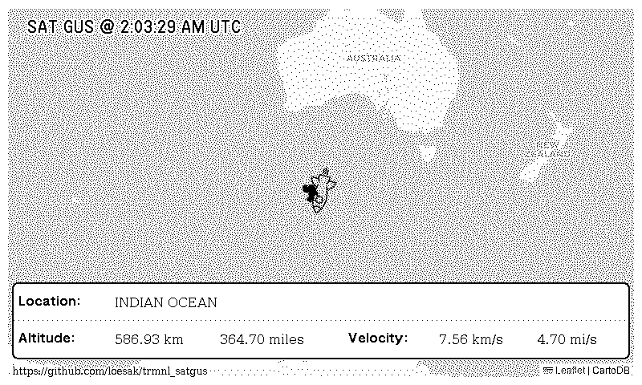
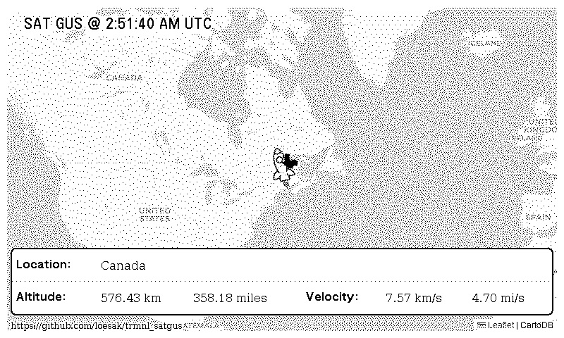

# TRMNL SAT GUS

Easily track SAT GUS, the [Space Selfie satellite by Mark Rober and CrunchLabs](https://space.crunchlabs.com/), directly from your [TRMNL device](https://usetrmnl.com/) with this plugin. 

This project provides a TRMNL plugin for satellite tracking, distance and speed calculations for SAT GUS. Whether you're a space enthusiast or a CrunchLabs fan, you can follow SAT GUS as it orbits Earth from your location—all from your TRMNL device.





## Support the Developer

If you find this project enjoyable, or any of [my other open source projects](https://github.com/loesak) useful, please consider supporting me a bit. Your contributions help maintain this and other open source projects.

* [Ko-fi](https://ko-fi.com/aaronloes)
* [Buy me a Coffee](https://coff.ee/aaronloes)
* [Paypal Me](https://paypal.me/aaronloes)

## Features

- **SATGUS Tracking**: Track SATGUS position using TLE (Two-Line Element) data
- **Distance Calculations**: Calculate distance from ground to satellite
- **Speed Calculations**: Calculate speed of the satellite
- **Location Identification**: Determine the country, continent, or body of water SATGUS is currently passing over, using geospatial data


## Development Setup

This project uses Dev Containers for development. To get started, open the project in Dev Container supporting IDE and start coding.

## Project Structure

```
satgus-trmnl/
├── .devcontainer/              # Dev container configuration
│   ├── docker-compose.yml
│   ├── devcontainer.json
│   ├── devenv.dockerfile
│   └── postCreate.sh
├── .github/
│   └── workflows/             # GitHub Actions workflows
│       ├── fetch-tle.yml      # Automated TLE data fetching
│       └── fetch-position.yml # Automated position data fetching
├── trmnl_data/                 # Data files
│   ├── satgus_tle.json         # TLE data - auto updated by GitHub Actions
│   ├── satgus_position.json    # Satellite position data - auto updated by GitHub Actions
│   ├── ne_110m_ocean.geojson
│   ├── ne_110m_land.geojson
│   ├── ne_110m_geography_marine_polys.geojson
│   └── ne_110m_admin_0_countries.geojson
├── trmnl_plugin/               # Plugin files
│   ├── markup.trmnl.html       # Terminal HTML template
│   ├── markup.emulation.html   # Emulation HTML template
│   └── gusrocket.webp          # Rocket image
├── trmnl_satgus/               # Main package
│   ├── satgus/
│   │   ├── __init__.py
│   │   ├── calculate_position.py   # Satellite position calculation
│   │   ├── fetch_tle.py            # TLE data fetching
│   │   └── location_utils.py       # Location utilities
│   ├── tests/                      # Test files
│   │   ├── __init__.py
│   │   └── test_satellite.py       # Tests for position calculation
│   ├── pyproject.toml              # Poetry configuration
│   ├── pre-commit.sh               # Pre-commit script
├── pre-commit-config.yaml      # Pre-commit hooks
└── README.md
```

## Available Commands

Once inside the dev container, you can:

### trmnl_satgus

Use the following Poetry commands from within the trmnl_satgus submodule:

- `poetry install` - Install dependencies
- `poetry run python trmnl_satgus/fetch_tle.py` - Fetch the latest TLE data for SATGUS
- `poetry run python trmnl_satgus/calculate_position.py` - Run the satellite position calculator
- `poetry run pytest` - Run tests
- `poetry run black .` - Format code with Black
- `poetry run flake8 .` - Lint code with Flake8
- `poetry run isort .` - Sort imports with isort
- `poetry run mypy .` - Type check code with mypy
- `poetry run bandit -r .` - Run security linter with Bandit

### trmnl_plugin

Use the following TRMNLP commands from within the trmnl_plugin submodule:

- `trmnlp serve` - Run the local TRMNL preview.

## Satellite Tracking Usage

## Dependencies

The project uses:
- **skyfield**: Astronomical calculations and satellite tracking
- **numpy**: Numerical computations
- **requests**: HTTP requests for data fetching
- **reverse-geocoder**: Reverse geocoding for locations
- **geopandas**: Geospatial data processing
- **shapely**: Geometry operations
- **pyproj**: Coordinate transformations

### Development dependencies
- **pytest**: Testing
- **black**: Code formatting
- **flake8**: Linting
- **isort**: Import sorting
- **mypy**: Type checking
- **bandit**: Security linting

## AI-Assisted Development

This project was developed with the assistance of artificial intelligence tools to help with code generation, documentation, and automation. All code and documentation have been reviewed and tested by human contributors.

